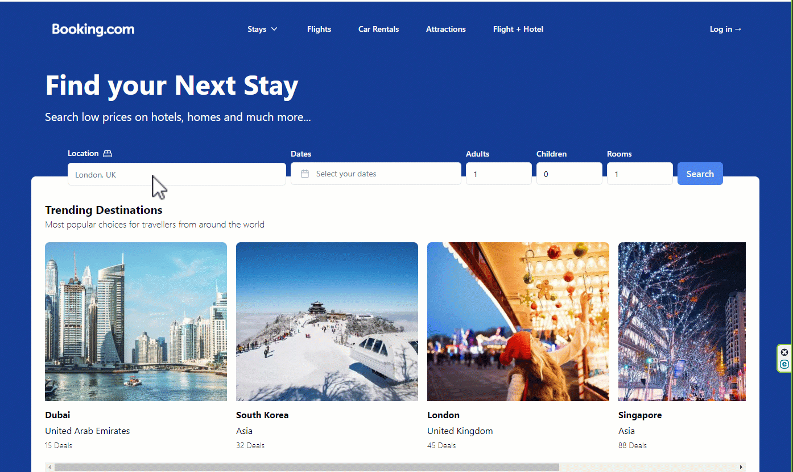

## Booking.com scraping

### Next.js 14, Server Actions, Tailwind, Oxylabs, Shadcn, Tailwind, TypeScrypt

[Visit site](https://booking-scraping-sxidsvit.vercel.app/)

#### .env
```js
OXYLABS_USERNAME=
OXYLABS_PASSWORD=
```


---
##### Contact with me: 
[][linkedin]

[linkedin]: https://www.linkedin.com/in/sergiy-antonyuk/

##### I can't express how much I have learned from [you](https://www.youtube.com/@SonnySangha) ! <br> Thanks for the hard and smart work.
